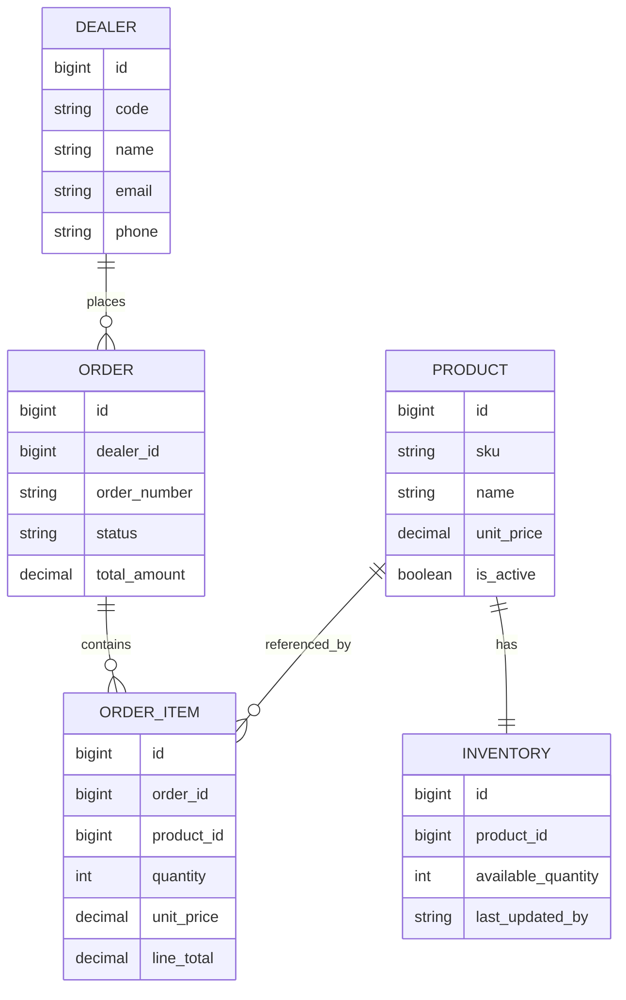

# Sales Order & Inventory Lite

A Django REST Framework backend with a React frontend for managing products, dealers, inventory, and sales orders with stock validation and controlled order transitions.

## Features Implemented

- Product management with unique SKU and live stock visibility
- Dealer management with dealer-wise order history
- Draft order creation and update with multiple line items
- Order confirmation with stock validation for every item
- Atomic stock deduction on order confirmation
- Strict order status flow: `draft -> confirmed -> delivered`
- Inventory listing and manual stock adjustment endpoint
- Order summary/report endpoint with aggregate totals and breakdowns
- Auto-generated order numbers in `ORD-YYYYMMDD-XXXX` format
- Preserved item price at order time
- Automated total and line-total calculation
- PostgreSQL-backed persistence
- Business-logic API tests
- React frontend
- Docker and docker-compose setup

## Tech Stack

- Python 3.12
- Django 4.2.11
- Django REST Framework 3.14.0
- PostgreSQL
- React 19
- Vite 8

## Project Structure

```text
.
|-- backend/
|   |-- config/
|   |-- orders/
|   |-- .env.example
|   |-- Dockerfile
|   |-- docker-entrypoint.sh
|   |-- manage.py
|   `-- requirements.txt
|-- frontend/
|-- .gitignore
|-- docker-compose.yml
|-- README.md
`-- Sales_Order_Inventory.postman_collection.json
```

## Data Model Overview

### Product
- `sku` unique and indexed
- `name`
- `description`
- `unit_price`
- `is_active`
- timestamps

### Inventory
- one-to-one with `Product`
- `available_quantity`
- `last_updated_by`
- timestamps

### Dealer
- `code` unique and indexed
- `name`
- `email` unique
- `phone`
- `address`
- `is_active`
- timestamps

### Order
- belongs to `Dealer`
- `order_number` unique and auto-generated
- `status`: `draft`, `confirmed`, `delivered`
- `total_amount`
- timestamps

### OrderItem
- belongs to `Order`
- references `Product`
- `quantity`
- `unit_price` snapshot
- `line_total`
- unique constraint on `(order, product)`

## Schema Diagram



## Important Business Rules

- Stock is deducted only when an order moves from `draft` to `confirmed`
- If any item has insufficient stock, the full confirmation request is rejected
- Draft orders can be edited
- Confirmed and delivered orders cannot be edited
- Delivered orders cannot move back to earlier states
- Inventory updates do not retroactively change historical order prices

## Setup Instructions

### Backend

Install dependencies:

```bash
cd backend
pip install -r requirements.txt
```

Create PostgreSQL database:

```text
sales_order_inventory
```

Use values similar to [backend/.env.example](/d:/Assignment/Project/backend/.env.example):

```env
POSTGRES_DB=sales_order_inventory
POSTGRES_USER=postgres
POSTGRES_PASSWORD=root
POSTGRES_HOST=127.0.0.1
POSTGRES_PORT=5432
```

On PowerShell:

```powershell
$env:POSTGRES_DB='sales_order_inventory'
$env:POSTGRES_USER='postgres'
$env:POSTGRES_PASSWORD='root'
$env:POSTGRES_HOST='127.0.0.1'
$env:POSTGRES_PORT='5432'
```

Run migrations:

```bash
cd backend
python manage.py migrate
```

Start backend server:

```bash
cd backend
python manage.py runserver
```

Backend API base URL:

```text
http://127.0.0.1:8000/api/
```

### Frontend

Run frontend locally:

```bash
cd frontend
npm install
npm run dev
```

Frontend URL:

```text
http://127.0.0.1:5173/
```

The Vite dev server proxies `/api` requests to Django on `http://127.0.0.1:8000`.

## Docker Setup

Run the full stack with Docker:

```bash
docker compose up --build
```

This starts:

- Django app on `http://127.0.0.1:8000`
- PostgreSQL on port `5432`

The app container automatically runs migrations before starting the server.

## API Endpoints

### Products

- `GET /api/products/`
- `POST /api/products/`
- `GET /api/products/{id}/`
- `PUT /api/products/{id}/`
- `DELETE /api/products/{id}/`

Example create payload:

```json
{
  "sku": "BP-001",
  "name": "Brake Pad",
  "description": "Front brake pad set",
  "unit_price": "500.00",
  "is_active": true
}
```

### Dealers

- `GET /api/dealers/`
- `POST /api/dealers/`
- `GET /api/dealers/{id}/`
- `PUT /api/dealers/{id}/`

Example create payload:

```json
{
  "code": "ABC001",
  "name": "ABC Motors",
  "email": "abc@gmail.com",
  "phone": "9999999999",
  "address": "Mumbai",
  "is_active": true
}
```

### Orders

- `GET /api/orders/`
- `GET /api/orders/summary/`
- `POST /api/orders/`
- `GET /api/orders/{id}/`
- `PUT /api/orders/{id}/`
- `POST /api/orders/{id}/confirm/`
- `POST /api/orders/{id}/deliver/`

Supported list filters:

- `GET /api/orders/?status=confirmed`
- `GET /api/orders/?dealer=1`

Example draft order payload:

```json
{
  "dealer": 1,
  "items": [
    {
      "product_id": 1,
      "quantity": 10
    }
  ]
}
```

Example insufficient stock response:

```json
{
  "detail": "Insufficient stock for one or more products.",
  "items": [
    {
      "product_id": 2,
      "product_name": "Oil Can",
      "available_quantity": 5,
      "requested_quantity": 10,
      "message": "Insufficient stock for Oil Can. Available: 5, Requested: 10"
    }
  ]
}
```

### Inventory

- `GET /api/inventory/`
- `PUT /api/inventory/{product_id}/`

Example update payload:

```json
{
  "adjustment_quantity": 25,
  "updated_by": "admin"
}
```

## Testing

Run the automated test suite:

```bash
cd backend
python manage.py test orders
```

Current test coverage includes:

- successful order confirmation and delivery
- insufficient stock rejection
- confirmed order edit rejection
- invalid delivery transition rejection
- inventory adjustment validation
- duplicate product validation
- order filtering by status
- order summary/report endpoint

## Postman Collection

Included file:

- `Sales_Order_Inventory.postman_collection.json`

Import it into Postman and set the collection variables:

- `base_url`
- `product_id`
- `dealer_id`
- `order_id`

## Assumptions

- Each product must always have exactly one inventory row
- Product deletion is blocked if the product is already part of an order
- Dealer deletion is intentionally not exposed in the API
- Dealer email is restricted to `@gmail.com` in this implementation
- `unit_price` in `OrderItem` is stored permanently to preserve historical pricing
- Inventory update endpoint applies additive stock corrections and never allows stock below zero
- Confirmed orders can be deleted and restore stock; delivered orders cannot be deleted
- Authentication and role-based permissions were not added because they were not required in the assignment

## Current Status

Completed:

- Core backend APIs
- PostgreSQL setup
- Business rules for stock and order flow
- Automated tests
- Order summary/report endpoint
- Postman collection
- React frontend
- Docker setup

Pending:

- final submission push
